# Do Quick Poll -documentation
**A Place Where you can conduct polls and do analysis on the go with no efforts.**

**This is just the begining we have a long way to go, hey don't worry we have got it all covered here**

## Table of Contents

- [Getting Started](#Getting-Started)
- [Create user](#Create-user)
- [Create Company](#Create-Company)
- [Manage Company](#Manage-Company)
- [Create Polls](#Create-Polls)
- [Create Questions](#Create-Questions)
- [Launch Polls](#Launch-Polls)
- [Launch Questions](#Launch-Questions)
- [Invite Poll Participants](#Invite-Poll-Participants)
- [Analyse Results](#Analyse-Results)
- [Delete polls](#Delete-polls)
- [Delete Questions](#Delete-Questions)
- [Delete companiy](#Delete-companiy)
- [View conducted polls](#View-conducted-polls)
- [Frequently asked Questions](#Frequently-asked-Questions)
- [More..](#More)

<a name="Getting-Started"/>
#### Getting Started
This is the guide for using Doquickpoll application for Conducting Quiz, Surveys which can be static and dynamic, Polls, Questionaire
You can create a Poll, survey, questionaire, test or a quiz.
Add questions to the created artifact.
These questions can have different types of answer sets in terms of multiple choice, binary or a free flow text.
The admins of the poll can conduct the polling and survey. 
and so much more

<a name="Create-user"/>
#### Create user
Creating a user and being a part of a company is a mangatory step to conduct polls or quiz, This can be done by clicking a Login button on top right corner of your page. once after clicking if you have already have a account registered, you can enter credentials and login. If you are a new user you can click register on the screen and fill the simple form consisting of your username, Email ID, Password, preferred Email, Mobile number, your name to be addressed and if you are available to comtact select 'Yes' else select 'No' and finally click on register.

<a name="Create-Company"/>
#### Create Company
Being a part of a company is mandaory if you want to conduct polls or quiz, This can be done once you login as a user, click on the Create Company Button you can see on your screen. once you click on the screen you can see a forn sliding in from the right side of your screen. Where you need to enter Company code, Company Name, Company Address, Company Contact(A contact where we a communicate), Company Phone number, Moble number, Email address, Accept the terms and condition by selecting it as true and click Add button to create a company.

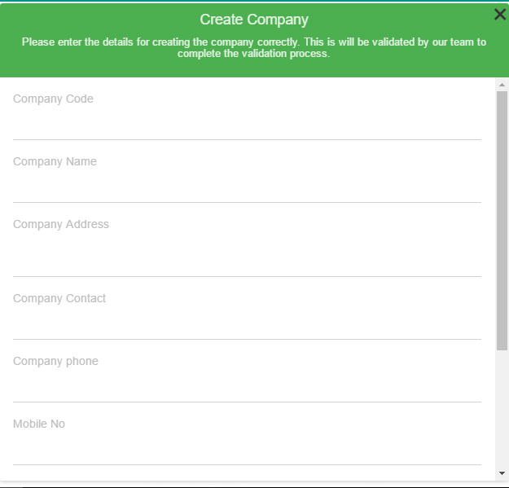

<a name="Manage-Company"/>
#### Manage Company
Manage Company gives you the leverage to manage your company, see the details, edit Details, see list of users add a new user to the company, add a new admin to the company or remove the user. To Edit company details all you need to do is click on the pencil icon on the top right corneer of the company detail template and you will be redirected to a form where you can edit the company details and click on update to commit changes about the company. 

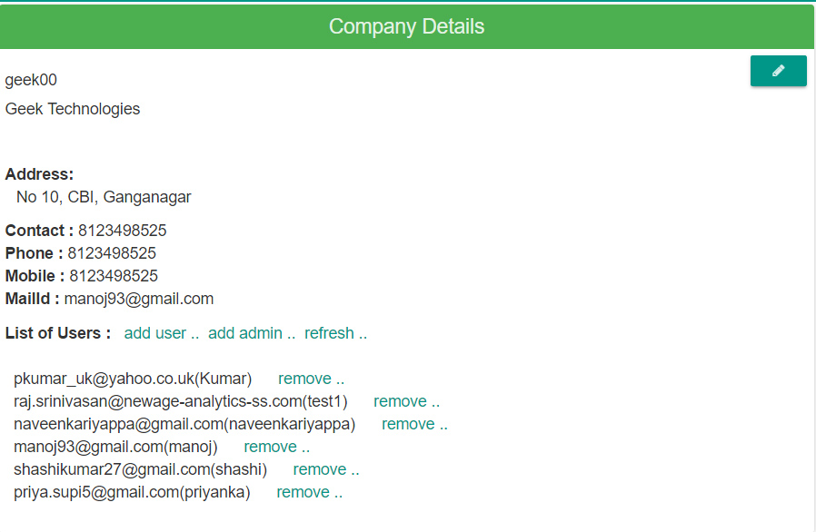

<a name="Create-Polls"/>
#### Create Polls
Create Polls gives you the leverage to create polls, Once you create polls you can add questions to polls. Creating Polls can be achieved in two ways
  
  ##### Adding Polls from Hands on Excel
  Adding polls from hands on excel can be achieved by running through the following steps
  
  Firstly you need to have the admin privillges to create a poll in a company
  once you login as a admin you can see a Load data button on the top right corner of your screen nect to the logout button, you can click on that to and you can see a dropdown where you can see options like Polls and Questions. you need to select Polls to add Polls from hands on Excel.
  
  Once you select Polls you can see the following screen 
  
  ![Hands on exxel polls] (images/Hands-onExcelPoll.jpg)
  
  once you see the following screen you are ready to add polls using hands on excel
  
 - In your Excel, select the poll data that you want to copy
 - Copy the data.
 - Switch to page showing the above scren and paste the data copied from your excel sheets 

Here you will leverage to manage polls for 

Creating, Launching, Deleting and Managing the Polls! (Poll cards)

- Make sure you have selected insert on the action column This will instruct to the system that data is being inserted
- Make sure you have put Poll code in all capital characters example POLL01 and is a 6 characher code which is used to distingush between polls This format is expected is standardised data within polls
- Give a appropriate poll name at the column which says Poll nameExample Science Class
- Give a small discription for the poll
- Editor -
- Status -
- Save Button is used to save the data to the lacal system Note:- This data is only saved in the lacal syatem to load the data onto the server you need to load it as Load Application data
- Load saved data button is used to load data from your local system Note:- This data is being loaded from the local system if you intend to load it from the server please select Load Application Data
- Load Application Data Button
- Update Application Data Button

<a name="Create-Questions"/>
#### Create Questions

Create Polls gives you the leverage to create polls, Once you create polls you can add questions to polls. Creating Polls can be achieved in two ways
  
  ##### Adding Questions from Hands on Excel
  Adding polls from hands on excel can be achieved by running through the following steps
  
  Firstly you need to have the admin privillges to create a question in a poll
  once you login as a admin you can see a Load data button on the top right corner of your screen nect to the logout button, you can click on that to and you can see a dropdown where you can see options like Polls and Questions. you need to select Question to add Question from hands on Excel.
  
  Once you select Question you can see the following screen 
  
  ![Hands on excel polls] (images/Hands-onExcelQuestion.jpg)
  
  once you see the following screen you are ready to add questions using hands on excel
  
 - In your Excel, select the poll data that you want to copy
 - Copy the data.
 - Switch to page showing the above scren and paste the data copied from your excel sheets 

Here you will levereage to manage Questions for 

Creating, Launching, Deleting and Managing the Questions! (Poll cards)

 - Make sure you have selected insert on the action column This will instruct to the system that data is being inserted
 - Make sure you have put Question code and Poll code in all capital characters example Ques01 and is a 6 characher code which is used to distingush between Questions This format is expected is standardised data within polls
 - At Column Question type the questions
 - Status :-
 - Sequence :-
 - Answer Type :-
 - Number of options :-
 - Options :-
 - Answer yes /no :-
 - Answer :-
 - Save Button is used to save the data to the lacal system Note:- This data is only saved in the lacal syatem to load the data onto the server you need to load it as Load Application data
 - Load saved data button is used to load data from your local system Note:- This data is being loaded from the local system if you intend to load it from the server please select Load Application Data
 - Load Application Data Button
 - Update Application Data Button

<a name="Launch-Polls"/>
#### Launch Polls
  
  Launching a Poll gives you leverage to Launch and analyse the results. Before you could launch a poll you need to have the admin privillages to launch a Poll.  To launch a poll you need to simply select Manage Poll button from your home screen, you can see this button only if you have the right privillages, Once you click on manage polls you can see all the polls created in your company. As shown in the image below
  
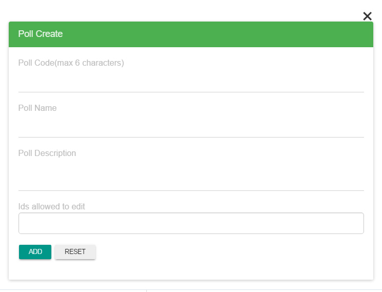

  as you can see there are four buttons for each poll - Creating, Launching, Deleting and Managing the Polls! (Poll cards) 
  
1. The first button on the poll card lets you to view the details of the poll.
  - You can also Edit or Delete Poll from the view poll template, In the View Poll you can see a Pencil and a Trash symbol on the top left corner of the template. The Trash like button lets you delete the poll and the pencil like button lets you edit the poll. Make sure you change the status to rready to keep the poll ready to launch.
  
  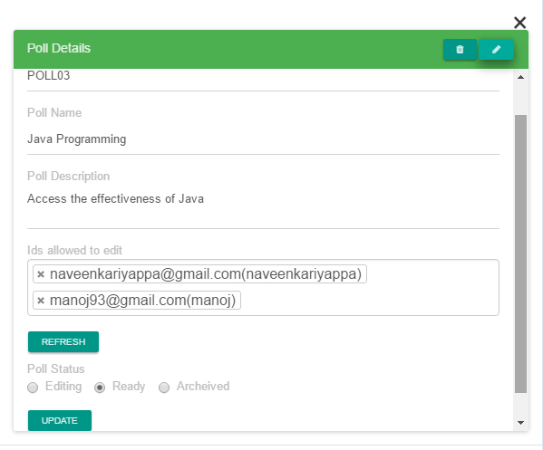
  
2. The second button on the poll card lets you to launch your poll, that is changing the poll status from editing to ready, so that you can release it across. 
3. The third button(trash shaped) is to delete the poll.
4. The fourth button(? shaped) is to get inside the poll, to view all the questions in that perticular poll.

  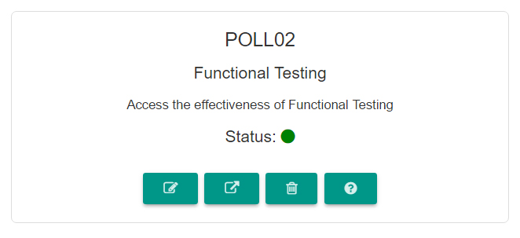
    
5. The poll+ button just below the hamburger icon is to create a new poll.
6. Also the plus button just below the logout button is to create a new poll. The button next to it, is to check the poll conducted list.
7. Poll code should always be in upper case.
8. To Launch poll click on the second button with the launch symbol, once you click the second button you should be getting a confirmation pop-up asking if are you sure to launch the poll. Select Launch to Lauunch the poll

  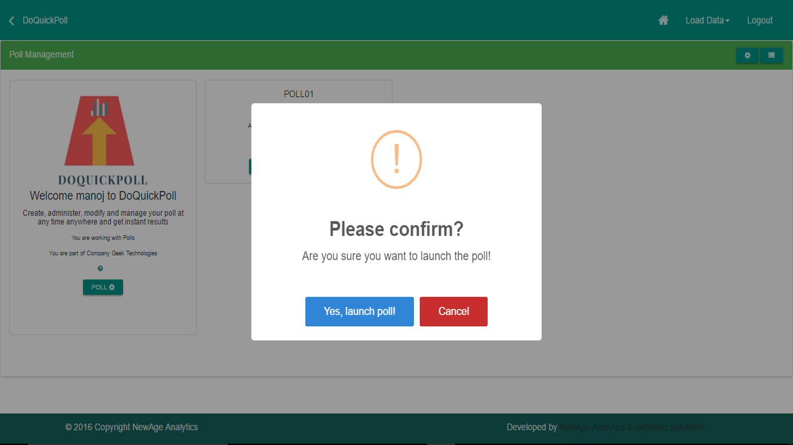
  
<a name="Launch-Questions"/>
#### Launch Questions
Launching a question gives you leverage to Launch and analyse the results of that perticular questions. Before you could launch a Question you need to have the admin privillages to launch a Poll and so forth a question. To launch a question you need to simply select Manage Poll button from your home screen, you can see this button only if you have the right privillages, Once you click on manage polls you can see all the polls created in your company. As shown in the image below

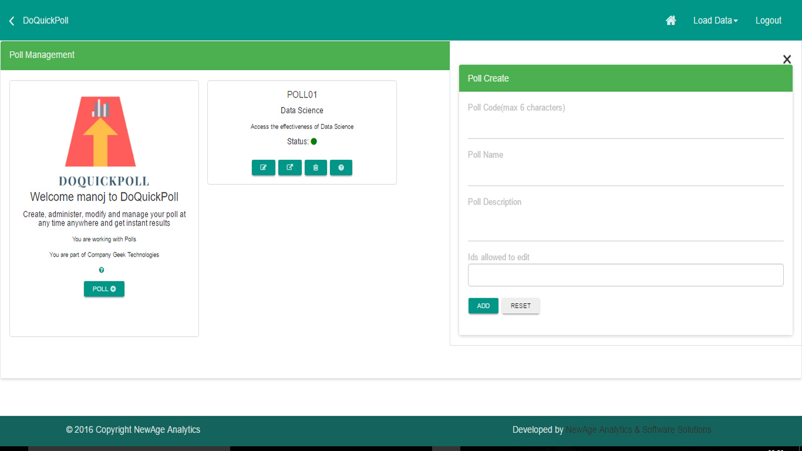

here you can find the list of all the polls created in your company. You need to select the poll which you intend to launch, remember a question always belong to a Poll. If you have not created Poll please do so. refer [Create Polls](#Create-Polls), to create a Poll. however if you alrrady have a Poll created you need to be have created a question to launch it. If you have not created a question and added into your poll please do so. refer [Create Questions](#Create-Questions) to create a question. Once you have created the question to launch the question you need to have launched the poll if you have not launched the poll. please do so. refer [Launch Polls](#Launch-Polls) to launch a poll.
And finally once the Poll is launched you can see the following screen. 

   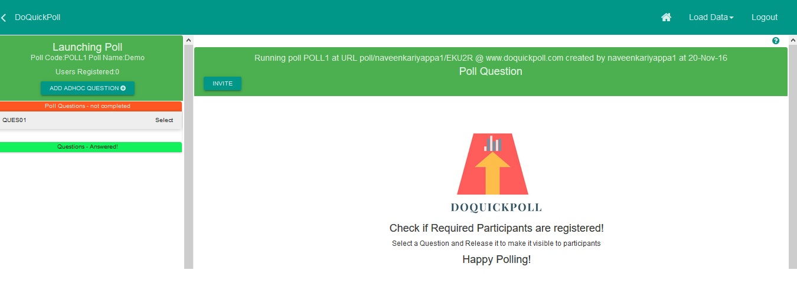

Here you can see all the questions which are ready to be launched on the left hand side of your screen. please note that if the questions are in editing state, though you launch poll you won't be able to see the questions. Hence make sure the question are in ready state.
once you see all the questions please click on select to get in to Launch console and you should be seeing the following screen
    
   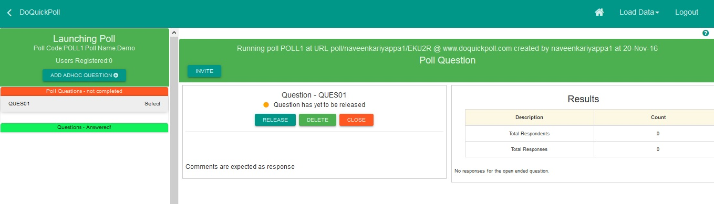 

Here you can see the question code, Status and options like Release, Delete and Close that perticular Questions selected.

  - 1 Select Release to launch the questions, Once you select release you must be seeing at a pop-up asking for time(in seconds), Please select the appropriate time and click OK. Note the Default time is 30 seconds(if you don't select time limit it is 30 seconds by default).
       
  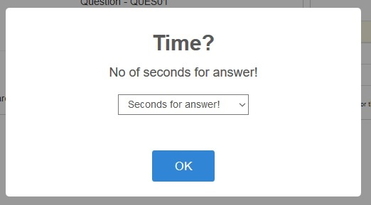
 
  - 2 Select Delete to delete that perticular question.
  
  - 3 elect Close to Close that perticular question manually.
      
<a name="Invite-Poll-Participants"/>
#### Invite Poll Participants
Inviting a poll is a necessary step to invite participants to your Poll. Before you could invite a participant you need to have the admin privillages to launch a Poll and so forth invite a participant. To invite you need to simply select Manage Poll button from your home screen, you can see this button only if you have the right privillages, Once you click on manage polls you can see all the polls created in your company. As shown in the image below

   

Here you can find the list of all the polls created in your company. You need to select the poll which you intend to launch and Launch the poll to invite, Once you launch the poll you should be able to see the following screen.

   
   
Here you can find Invite button on the Top of the screen. Click on the invite button and the following pop-up screen where you can type in the participant's mail ids to invite and click OK. This sends a mail to the participants with the url.

  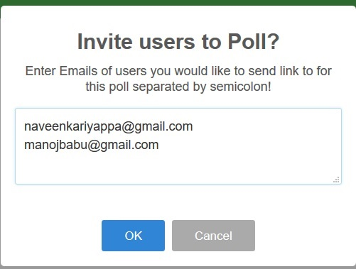
    
There is also another way to invite participants, Once you Launch the poll you can see the generated url on the top on the screen, you can also copy the url and send it via any texting medium like messages, whatsapp, facebbook etc.

<a name="Analyse-Results"/>
#### Analyse Results
Analysing resuls is very simple. you can do it when a question is closed after polling, Once the question is closed the results can be seen on the right side template of the question. Poll participants will also have the privillage to view the results as the they participate in the poll. The results for them is seen below the question.

<a name="Delete-polls"/>
#### Delete polls
Deleting a poll is very easy, all you need to do is from your home page just click on Manage Polls, In order to do so need to have the right privillages. Once you click on manage polls you will be able to see all the polls listed in your company. 
 
 
 
  as you can see there are four buttons for each poll - Creating, Launching, Deleting and Managing the Polls! (Poll cards) 
  
1. The first button on the poll card lets you to view the details of the poll.
  - You can also Edit or Delete Poll from the view poll template, In the View Poll you can see a Pencil and a Trash symbol on the top left corner of the template. The Trash like button lets you delete the poll and the pencil like button lets you edit the poll. Make sure you change the status to rready to keep the poll ready to launch.
2. The second button on the poll card lets you to launch your poll, that is changing the poll status from editing to ready, so that you can release it across. 
3. The third button(trash shaped) is to delete the poll.
4. The fourth button(? shaped) is to get inside the poll, to view all the questions in that perticular poll.
  
      
  
The third button(trash shaped) on the poll card is to Delete the poll. Click on it to Delete the poll, Once you click on delete button there will be a confirmation pop-up asking are you sure to delete the poll, just select delete to delete the poll.

   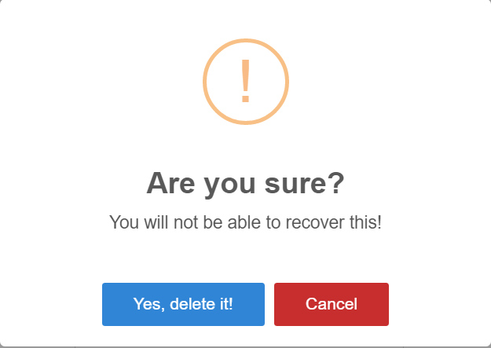

<a name="Delete-Questions"/>
#### Delete Questions

<a name="Delete-companiy"/>
#### Delete companiy

<a name="View-conducted-polls"/>
#### View conducted polls

<a name="Frequently-asked-Questions"/>
#### Frequently asked Questions

<a name="More"/>
#### More..
